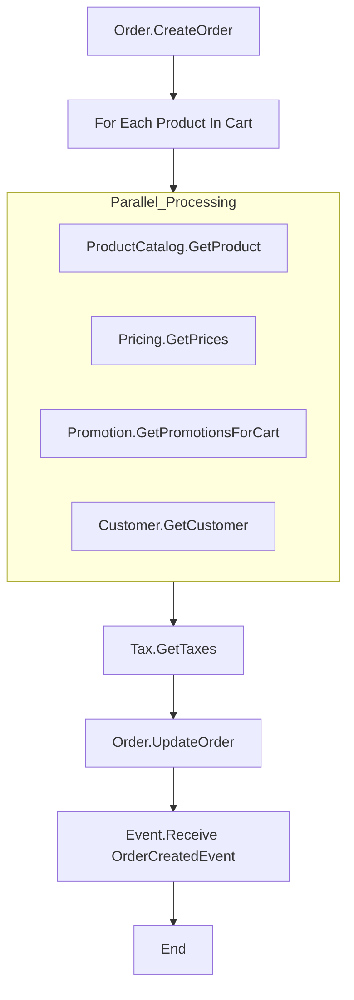

# Order Processing Workflow

This document describes the Step Function workflow for processing orders in our e-commerce system.

## Workflow Diagram

## Workflow Steps

1. **Order.CreateOrder**
   - Creates a new order cart
   - Method: POST
   - Endpoint: `/carts`

2. **For Each Product In Cart**
   - Iterates over each product in the cart
   - Executes the following steps in parallel for each product:

     a. **ProductCatalog.GetProduct**
     - Retrieves product details
     - Method: GET
     - Endpoint: `/products/${productId}`

     b. **Pricing.GetPrices**
     - Fetches pricing information
     - Method: GET
     - Endpoint: `/prices/${priceId}`

     c. **Promotion.GetPromotionsForCart**
     - Gets applicable promotions for the cart
     - Method: GET
     - Endpoint: `/promotions/cart`

     d. **Customer.GetCustomer**
     - Retrieves customer information
     - Method: GET
     - Endpoint: `/customers/${customerId}`

3. **Tax.GetTaxes**
   - Calculates taxes for the order
   - Method: GET
   - Endpoint: `/taxes`

4. **Order.UpdateOrder**
   - Updates the order with total amount, tax, and discount
   - Method: PATCH
   - Endpoint: `/carts/${cartId}`

5. **Event.Receive OrderCreatedEvent**
   - Sends an event notification for the created order
   - Method: POST
   - Endpoint: `/events/receive`

## Additional Information

- All API calls are made to the endpoint: `MyApiId.execute-api.us-east-1.amazonaws.com`
- The workflow uses AWS Step Functions and integrates with API Gateway for various operations
- Error handling and retry logic should be implemented as needed
- Ensure proper IAM permissions are set for the Step Function to invoke API Gateway endpoints
