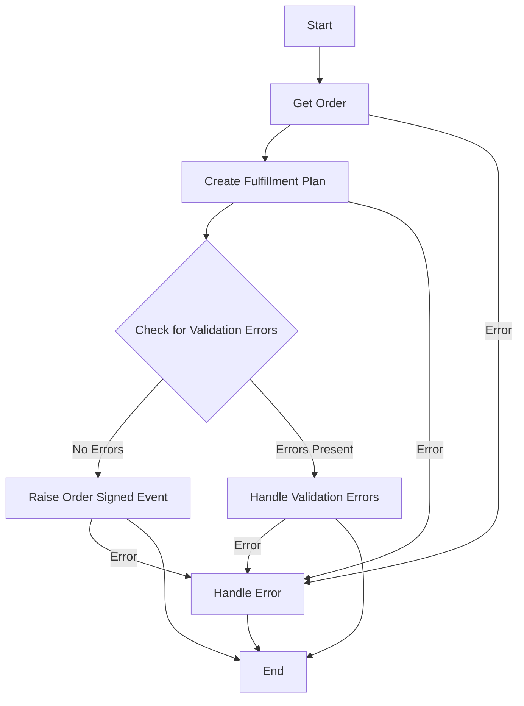

# Order Signing Workflow

## Overview
This AWS Step Functions state machine implements an order signing workflow. The process begins after a shopper has added items to their cart, chosen a delivery date, provided a delivery address, and selected a payment mechanism.

## Workflow Steps
1. Get the existing Order from the Order Service.
2. Pass the Order to the Fulfillment Service to create a fulfillment plan.
3. Check for validation errors.
4. If no validation errors are present, raise an event that the order has been signed.
5. If validation errors are present, handle them appropriately.

## API Gateway Integration
The workflow uses API Gateway for all web service calls. The pattern used for the API path is `{serviceName}/{actionPath}`.

## Error Handling
Each step includes error handling. If an error occurs at any point, the workflow transitions to a dedicated error handling state.

## Workflow Diagram

## Implementation Details
The workflow is implemented as an AWS Step Functions state machine. It uses the AWS SDK for invoking API Gateway endpoints. The main states in the workflow are:

1. GetOrder
2. CreateFulfillmentPlan
3. CheckForValidationErrors
4. RaiseOrderSignedEvent
5. HandleValidationErrors
6. HandleError

Each state that invokes an API uses the `arn:aws:states:::apigateway:invoke` resource and specifies the API endpoint, HTTP method, path, and request body (for POST requests).

## Usage
To use this workflow:

1. Deploy the API Gateway with the required endpoints.
2. Update the `ApiEndpoint` in the state machine definition with your API Gateway ID.
3. Deploy the state machine in AWS Step Functions.
4. Start an execution of the state machine, providing the order ID in the input.

## Note
Ensure that your API Gateway is properly configured to handle the requests from this state machine, including appropriate IAM roles and permissions.
