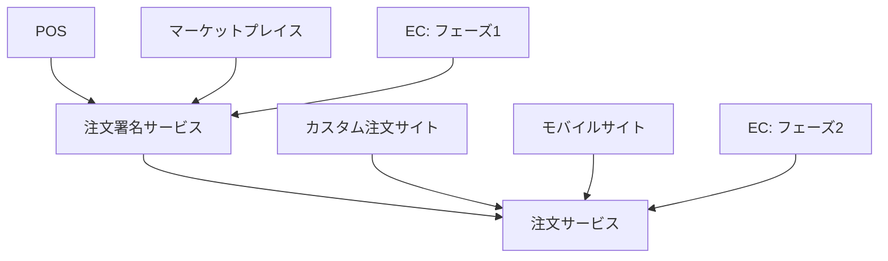

# サービス依存関係図

この図は、システム内の様々なクライアントとサービス間の依存関係を示しています。

## 説明

この図は以下の関係を示しています：

1. **POS**（販売時点情報管理）が**注文署名サービス**を呼び出します
2. **マーケットプレイス**が**注文署名サービス**を呼び出します
3. **EC**（eコマース）がフェーズ1で**注文署名サービス**を呼び出します
4. **注文署名サービス**が**注文サービス**を呼び出します
5. **カスタム注文サイト**が**注文サービス**を呼び出します
6. **モバイルサイト**が**注文サービス**を呼び出します
7. **EC**（eコマース）がフェーズ2で**注文サービス**を呼び出します

この視覚化により、システムの異なるコンポーネント間のデータの流れと依存関係を理解することができます。

## 凡例

- POS: 販売時点情報管理
- EC: eコマース
- OSS: 注文署名サービス
- OS: 注文サービス

## 注記

- ECシステムには2つの統合フェーズがあります：
  - フェーズ1: 注文署名サービスと統合
  - フェーズ2: 注文サービスと直接統合
