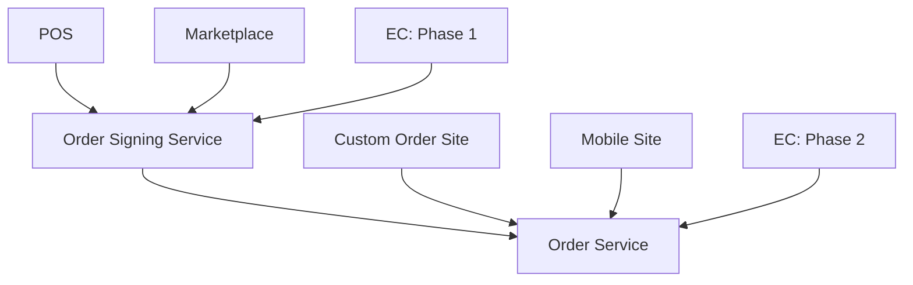

# Service Dependency Diagram

This diagram illustrates the dependencies between various clients and services in our system.

## Description

The diagram shows the following relationships:

1. **POS** (Point of Sale) calls the **Order Signing Service**
2. **Marketplace** calls the **Order Signing Service**
3. **EC** (E-Commerce) calls the **Order Signing Service** in Phase 1
4. The **Order Signing Service** calls the **Order Service**
5. **Custom Order Site** calls the **Order Service**
6. **Mobile Site** calls the **Order Service**
7. **EC** (E-Commerce) calls the **Order Service** in Phase 2

This visualization helps to understand the flow of data and dependencies between different components of the system.

## Legend

- POS: Point of Sale
- EC: E-Commerce
- OSS: Order Signing Service
- OS: Order Service

## Notes

- The EC system has two phases of integration:
  - Phase 1: Integrates with the Order Signing Service
  - Phase 2: Directly integrates with the Order Service
